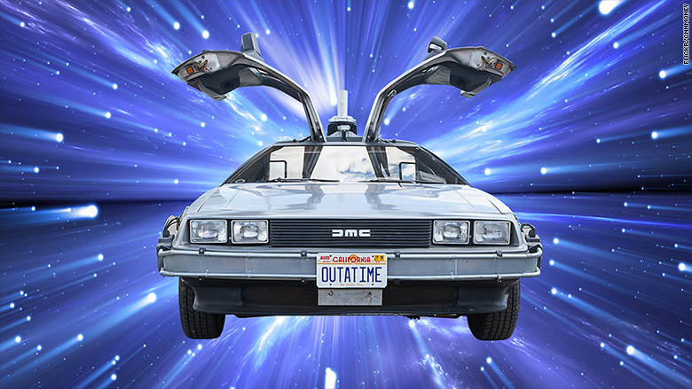
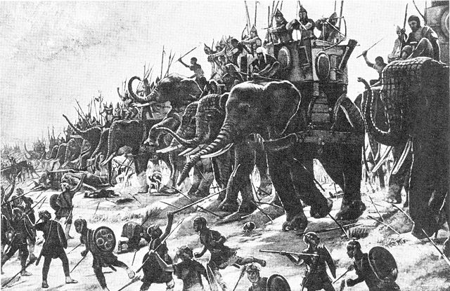
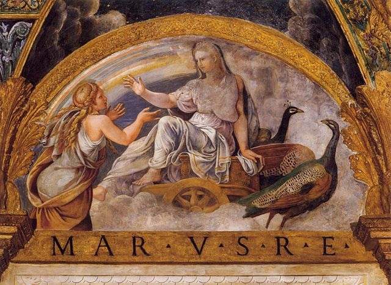
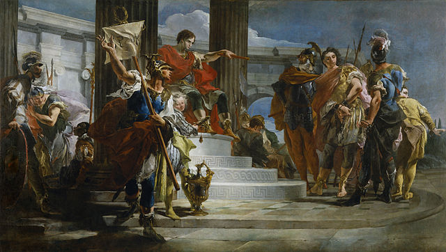
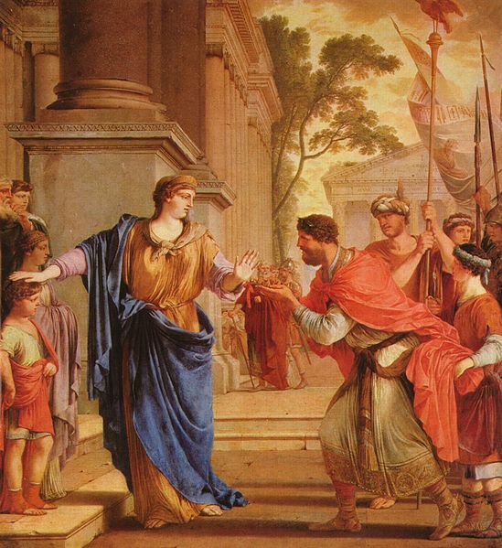
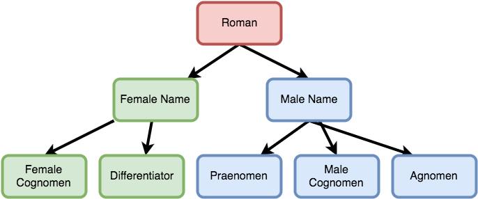
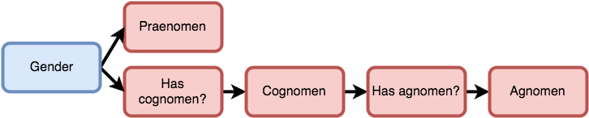

# Rolling Random Romans


^ Welcome. We're going to explore randomness in Elm

---

## Take a journey



^ Join me on a journey

---

## Republican Rome


^ Going to Republican Rome
period before emperors, approx 2000-2500 years ago

^ Republican Rome is not...

---


^ ... not this kind of republican
not this kind of elephant

---



^ more like this

---

## You

^
* you are an ancient software engineer
* business has been slow
* you've just finished lunch
* a person wearing a hood walks in
* then she reveals herself

---

## Juno



^ She is Juno, Roman goddess of marriage, fertility, and childbirth
(BTW, month of June is named for her)
She has a problem
She has to choose who gets children
She has to name them all
Rome's growing population makes this unsustainable
She has no life
Just last week, she had to miss out on a sweet party by Jupiter

---

## Your Mission

^ Your mission (should you choose to accept it)
automate the process
create a dashboard to pick new parents
randomly generate names
WARNING: must be a valid name

^ you are intrigued

---

# Roman Naming System

^ different for men and women

---

## Men



^ Publius Cornelius Scipo Africanus
military hero
the only one who could defeat Hannibal

---

## Praenomen

**Publius** Cornelius Scipio Africanus


^ Personal name, like modern day first name

---

## Nomen

Publius **Cornelius** Scipio Africanus


^ Family/Clan name, like modern last name

---

## Cognomen

Publius Cornelius **Scipio** Africanus


^ Nickname, can be inherited. Becomes a way to distinguish particular family
lines within a clan

---

## Agnomen

Publius Cornelius Scipio **Africanus**


^ A nickname/honorific given if already has cognomen

^ Some men don't have all names e.g. Gaius Julius Caesar or Mark Antony

---

## Women



^ System less consistent
Romans were sexist, women didn't get a personal name

^ Cornelia Africana Minor
daughter of Publius Cornelus Scipio
here seen refusing marriage to the king of Egypt

---

## Nomen

**Cornelia** Africana Minor


^ Family/clan name, feminine version
Julia, Cornelia, Antonia, etc

---

## Cognomen

Cornelia **Africana** Minor


^ Later republic, more common for women to inherit a cognomen/agnomen from
father

---

## Differentiator

Cornelia Africana **Minor**


^ Differentiates sisters. Can be a number. Minor is like modern "Junior"
sometimes translated "the Younger"

---

# Our program

^ You accept and get to work. Decide to use Elm.

---

## Model

```elm
type alias Id = Integer

type alias Model =
  { romans : Dict Id Roman
  , nextId : Id
  }
```

^ Dict makes it easier to update a roman in place

---

## Roman

```elm
type alias Roman =
  { id : Id
  , clan : Clan
  , children : Children
  , name : Name
  }

type Children = Children (List Roman)
```

^ Children type is to allow recursive types
fantastic compiler error here

---

## Name

```elm
type Name
  = FemaleName (Maybe String) (Maybe String)
  | MaleName String (Maybe String) (Maybe String)

type alias Clan =
  { name : String
  , color : String
  }
```

---

## View

```elm
viewRoman : Roman -> Html Msg
viewRoman roman =
    li [ style [ ( "color", roman.clan.color ) ] ]
        [ text (formattedName roman)
        , button [ onClick (GenerateChildFor roman) ] [ text "Bless with child" ]
        , viewChildren roman.children
        ]
```

^ Trigger event on click. Display name in color of clan

---

## Update

```elm
type Msg
    = GenerateChildFor Roman
    | Birth Roman Roman

update : Msg -> Model -> ( Model, Cmd Msg )
update msg model =
    case msg of
        GenerateChildFor father ->
            ( model, Random.generate (Birth father) Random.Roman.roman )

        Birth father child ->
          -- append child to father
          ( { model | romans = updatedRomans }, Cmd.none )

```

^ handle generation of child. handle birth. Before details, need to look at the
bigger picture

---

# Randomness in a functional world

^ not as straightforward as you think

---

## Pure functions

* `2 + 2 = 4`
* `floor 5.6 = 5`
* `toUpper "abc" = "ABC"`

^ always return the same value when passed same arguments

---

## Random is inherently not pure

```ruby
rand(1000) # => 964
rand(1000) # => 592
rand(1000) # => 482
rand(1000) # => 872
rand(1000) # => 815
```

^ Ruby's rand function

---

## Random as a pure function

```ruby
def seeded_rand(seed, max)
  srand(seed)
  rand(max)
end

seeded_rand(123, 1000) # => 510
seeded_rand(123, 1000) # => 510
seeded_rand(123, 1000) # => 510
seeded_rand(123, 1000) # => 510
seeded_rand(123, 1000) # => 510
```

^ Random can be expressed as pure function
Passing in a seed
Same value for same seed
Most languages do this behind the scenes
might seed from dev/random or dev/urandom on UNIX system

---

## Pseudo-random

^ Note that this is not cryptographically secure

---

# Random in Elm

^ How does Elm do this?

---

## Explicit Seed

```elm

randomBool : (Bool, Random.Seed)
randomBool =
  Random.step (Random.initialSeed 123) (Random.bool)
```

^ Random.step needs a seed and a generator
Generator generates a gives us a value of the desired type
Returns a random value (bool) and new seed to use in next operation
Need to get seed externally and pass in

---

## Commands

```elm
type Msg
  = RequestRandom
  | Generated Bool

update : Msg -> Model -> (Model, Cmd Msg)
update msg model =
  case msg of
    RequestRandom -> (model, Random.generate Generated Random.bool)
    Generated bool -> ({ model | flag = bool }, Cmd.none)
```

^ In Elm 0.17 we can use commands
Random.generate returns command, no need for seed
language runtime takes care of it
common to see this pattern of two messages

---

## Complex Values

```elm
roman : Random.Generator Roman
roman =
  -- generator for romans with random
  -- * praenomen
  -- * cognomen
  -- * agnomen
  -- * differentiator
  -- * gender
```

^ Roman requires many different random values
tedious to get all of them via a command
build a custom generator that returns composite value
only call generator once

---

# Building Generators

^ lets dive into generators

---

## Work from the bottom up



^ composed of multiple generators
easiest to start with simple ones and work up

---

## Using existing generator

```elm
import Random.Extra

differentiator : Random.Generator (Maybe String)
differentiator =
  let differentiators =
    [ "Maior"
    , "Minor"
    , "Prima"
    , "Tertia"
    ]
  in
    Random.Extra.sample differentiators
```

^ easiest to use existing generators
this one comes from Random.Extra package

---

## Transforming rolled values

```elm
femaleName : Random.Generator Name
femaleName =
  Random.map (FemaleName Nothing) differentiator
```

^ Often need to transform values from generator to get new value

^ here wrapping in FemaleName

^ hardcoded cognomen to Nothing (it might be inherited)

^ we really want multiple rolls

---

## Combining independent rolls

```elm
femaleName : Roman -> Random.Generator Name
femaleName father =
  Random.map2 FemaleName (femaleCognomen father) differentiator
```

^ femaleCognomen takes argument

^ map2 and friends combine n generators

^ function must have n arguments

^ Elm handles all the seeds

^ Declarative - we say what, elm figures out how

---

## Chain of dependencies



^ most rolls are not independent
particularly for male names

---

## Male name

```elm
maleName : Random.Generator Name
maleName =
  Random.map3 MaleName praenomen cognomen agnomen

```

^ like before combines 3 independent rolls

---

## Agnomen

```elm
agnomen : Maybe String -> Generator (Maybe String)
agnomen cog =
  case cog of
    Just _ ->
      Random.extra.sample ["Felix", "Cuncunctor", "Africanus"]
    Nothing ->
      Random.Extra.constant Nothing
```

^ like Juno told us, agnomen is not independent
generator should look like this
both cases need to return a generator
Nothing case returns constant generator Nothing

---

## Chaining dependent rolls

```elm
import Random exposing(andThen)

maleName : Random.Generator Name
maleName =
  Random.map3 MaleName praenomen cognomen (cognomen `andThen` agnomen)

```

^ andThen used to chain dependent rolls
returns a generator
if we used map, we would get generator of generators
andThen is like flat map
if you get nested generator error with map, you probably want andThen

^ there is a bug here
cogomen is being rolled twice
not same value

---

## Fixing a bug

```elm
import Random exposing(andThen)

maleNameFromCognomen : Maybe String -> Generator Name
maleNameFromCognomen cog =
  Random.map3 MaleName praenomen (Random.Extra.constant cog) (agnomen cog)

maleName : Generator Name
maleName =
  cognomen `andThen` maleNameFromCognomen
```

^ invert the order of things
name depends on cognomen
map3 requires 3 generators so use constant

---

## Random Playbook

* Existing generators
* Transform generators with `Random.map`
* Combine independent generators with `Random.map2` and friends
* Combine dependent generators with `Random.andThen`

^ You now know every technique

---

## `Random.Extra`

`elm-community/random-extra`

^ this package contains utility functions
can be really convenient
no magic here
you can implement these yourself with the techniques mentioned

---

## Remaining steps

* Rinse
* Repeat
* Profit $$$

---

## Extra Credit

* Some praenomina are favored by a family
* Cognomina can be hereditary
* weight rolls with percentages

---

# Demo Time

https://joelq.github.io/elm-conf-demo

---

## Principles

* Take advantage of Commands
* Make as few calls to `Random.generate` as possible
* Build up complex generators using `map`, `map2`, `andThen` etc
* Build from the bottom up

---

## About Me

* Twitter: @joelquen
* GitHub: @JoelQ
* Slides: JoelQ/elm-conf-talk
* Demo: JoelQ/elm-conf-demo

---

## Images credits

* **Dice** Michael and is distributed under the Creative Commons Attribution 4.0
  license.
* **SPQR** See page for author [CC BY 3.0 (http://creativecommons.org/licenses/by/3.0) or Public domain], via Wikimedia Commons
* **Republican Elephant** By Republican Party (United States) (http://www.gop.com/) [Public domain], via Wikimedia Commons

---

## Image credits (continued)

* **Elephants at Zama** Henri-Paul Motte [Public domain or Public domain], via
  Wikimedia Commons
* **Scipio Africanus** Giovanni Battista Tiepolo [Public domain or Public
  domain], via Wikimedia Commons
* **Cornelia Africana** Laurent de La Hyre [Public domain or Public domain], via
  Wikimedia Commons
